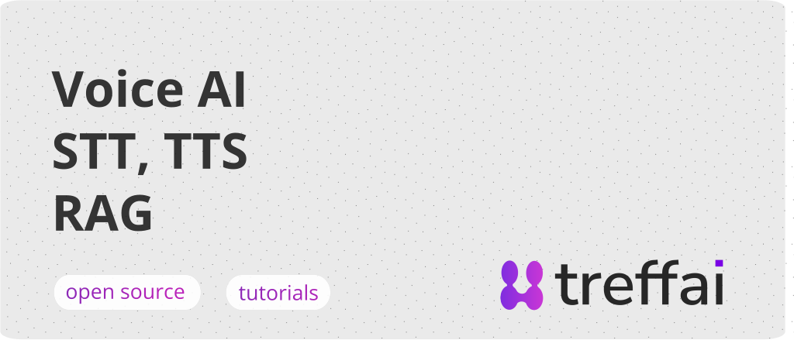

<a href="https://treffai.com">
  
</a>

<p>
  <a href="https://www.linkedin.com/in/daniel-sedl%C3%A1%C4%8Dek-23b859a9/">
    
  </a>
  <a href="https://linkedin.com/company/treffai">
    
  </a>
</p>

# Awesome Voice AI Apps

A collection of voice-powered AI applications exploring the exciting world of conversational AI, speech synthesis, real-time translation, RAG, and more.

## About This Repository

These are my fun side projects that I want to share to inspire and help other developers make the world a better place. Each project explores different aspects of voice AI technology, from multilingual speech synthesis applications, to full voice AI agents.

## Project Structure

The repository is a monorepo with a shared **Litestar** backend and **Vue 3** frontend. All four apps share common infrastructure (Azure Speech, OpenAI, Translator) through shared backend modules.

```
├── backend/          # Litestar Python backend (all apps)
│   └── src/apps/     # App-specific routes, services, schemas
├── frontend/         # Vue 3 + Tailwind CSS frontend (all apps)
│   └── src/apps/     # App-specific views, composables, components
└── docker-compose.yaml
```

## Apps

| App | Description | Technologies | Backend | Frontend |
|-----|-------------|--------------|---------|----------|
| McDonald's Voice Menu | Voice-controlled menu ordering with semantic search and basket management | Azure STT, Azure OpenAI, pgvector, sentence-transformers | [backend/src/apps/mcdonalds](./backend/src/apps/mcdonalds) | [frontend/src/apps/mcdonalds](./frontend/src/apps/mcdonalds) |
| Public Transport Voice | Speech-to-speech translation across 15 languages | Azure STT/TTS, Azure Translator | [backend/src/apps/transport](./backend/src/apps/transport) | [frontend/src/apps/transport](./frontend/src/apps/transport) |
| Dental Dictation | Hands-free periodontal exam data entry from voice dictation | Azure STT, Azure OpenAI | [backend/src/apps/dental](./backend/src/apps/dental) | [frontend/src/apps/dental](./frontend/src/apps/dental) |
| Psychotherapy Tracker | Wellness monologue analysis with psychological metric tracking | Azure STT, Azure OpenAI | [backend/src/apps/psychotherapy](./backend/src/apps/psychotherapy) | [frontend/src/apps/psychotherapy](./frontend/src/apps/psychotherapy) |

Each backend app has its own README with a detailed description and setup instructions.

## Getting Started

The quickest way to run everything is with Docker Compose:

```bash
docker compose up        # Starts db (:5432), backend (:8000), frontend (:5173)
```

You can also run the backend and frontend locally without Docker:

```bash
# Backend
cd backend
uv sync
uv run uvicorn src.app:app --reload --host 127.0.0.1 --port 8000

# Frontend (in a separate terminal)
cd frontend
npm install
npm run dev
```

For more details on local setup (database, migrations, environment variables), see the individual app READMEs in `backend/src/apps/`.

## Contributing

Feel free to:
- Open issues with ideas for new voice AI apps
- Submit PRs to improve existing projects
- Fork and build your own variations
- Add new apps

## License

MIT - Use these projects to learn, build, and create something awesome.

---
